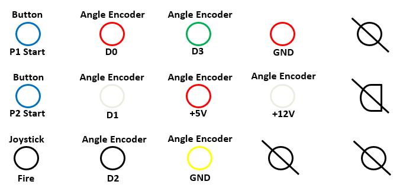
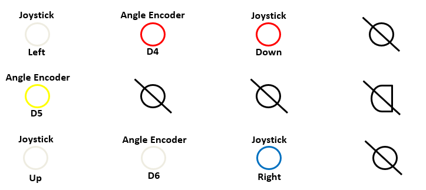

# Tron Controller 

## Retrofuturistic Hardware Project

This project is using a RP2040 chip in order to take information coming from the Tron Arcade Cabinet Controller and turning the signals to the appropriate game controller inputs.

### Wiring Diagrams
These diagrams are from previous semesters and were drawn by other students

