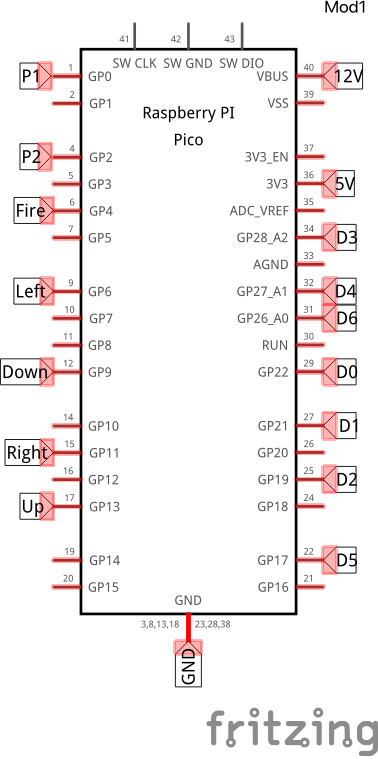

# Tron Controller 

## Retrofuturistic Hardware Project

This project is using a RP2040 chip in order to take information coming from the Tron Arcade Cabinet Controller and turning the signals to the appropriate game controller inputs.

## Final Steps
- Improve the quadrature decoder to handle larger spins
- Permanently connect the pico wires

### Setup
1) First you must flash the pi pico using the included CircuitPython.uf2 file.
2) Next you must copy the contents from the `Pico Root` folder onto the microcontroller.
3) Using the diagrams below, wire the pico and controller together

### Fritzting Diagram
This is a diagram of the Pico. Below are diagrams for the output of the molex connectors but this diagram is for actually connecting the molex cables to the pico.

### Wiring Diagrams
These diagrams are from previous semesters and were drawn by other students

<!-- Mad Planets -->